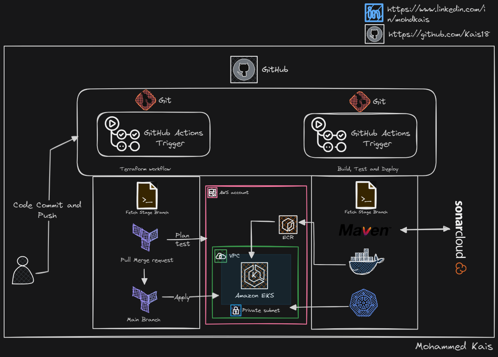

# Terraform backend CICD AWS
This is the terraform Repository for AWS Services running  all the backend services for the front end Application services from [Application_services_Kubernetes_project
](https://github.com/Kais18/Application_services_Kubernetes_project) Repository, where are changes commited to this repository for any **Terraform File** will trigger the changes in the code and insfrastructure
using **Git Actions**< /br>
Any changed done to the **main** branch will only Trigger the deploy from Git actions where in changes for the stage branch won't, this practice will avoid any mistakes during real time production < /br>
Follow uo with  [Application_services_Kubernetes_project](https://github.com/Kais18/Application_services_Kubernetes_project) for complete project.

**Services Used**:

- Terraform
- GitHub Actions
  
# Prerequisites
#####
- JDK 11
- Maven 3
- MySQL 8 

# Technologies 
- Spring MVC
- Spring Security
- Spring Data JPA
- Maven
- JSP
- MySQL
# Database
Here,we used Mysql DB 
MSQL DB Installation Steps for Linux ubuntu 14.04:
- $ sudo apt-get update
- $ sudo apt-get install mysql-server

Then look for the file :
- /src/main/resources/db_backup.sql
- db_backup.sql file is a mysql dump file.we have to import this dump to mysql db server
- > mysql -u <user_name> -p accounts < db_backup.sql

  
## Author
- Twitter: [@kaissssssss08](https://twitter.com/kaissssssss08)
- LinkedIn:[mohdkais](https://www.linkedin.com/in/mohdkais/)
- Portfoli:[kaiswork.shop](https://www.kaiswork.shop)
